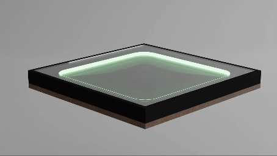
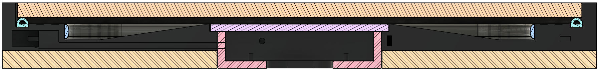

# MusicLightTiles

## About

This project is a set of 3D printed tiles that light up and play music when you stand on them. 
The tiles are designed to be modular and can be arranged in any configuration you like or be used as standalone tiles.

> [!IMPORTANT]  
> This project is still in development and not yet finished.  
> All the code and designs are early prototypes and are subject to change.  

## Parts

The base of the tiles is 3D printed, all other components are off the shelf parts.
Below is a list of all the parts used to build 3 tiles.

| Part | Quantity | Price | Link |
| ---- | -------- | ----- | ---- |
| ESP32 (x3) | 1 | €22,99 | [Az-Delivery](https://www.az-delivery.de/nl/products/esp32-dev-kit-c-unverlotet?variant=32437204582496) |
| DC DC Step Down (x3) | 1 | €5,99 | [Az-Delivery](https://www.az-delivery.de/nl/products/lm2596s-dc-dc-step-down-modul-1?variant=12228728324192) |
| Media player (3x) | 1 | €8,49 | [Az-Delivery](https://www.az-delivery.de/nl/products/mp3-player-modul?variant=8198615695456) |
| Speaker (6x) | 1 | €13,99 | [Az-Delivery](https://www.az-delivery.de/nl/products/2-stuck-dfplayer-mini-3-watt-8-ohm-mini-lautsprecher-mit-jst-ph2-0-mm-pin-schnittstelle-fur-arduino-raspberry-pi-und-elektronische-diy-projekte-inklusive-e-book?variant=39441379131488) |
| Micro SD card 8gb | 3 | €4,79 | [Amazon.com.be](https://www.amazon.com.be/-/nl/Intenso-3413450-Micro-SDHC-geheugenkaart-GB-klasse/dp/B008RDCCFS/ref=sr_1_3?crid=32IRLW4WPV8D7&keywords=micro%2Bsd%2B4gb&qid=1695657846&s=electronics&sprefix=micro%2Bsd%2B4gb%2Celectronics%2C78&sr=1-3&th=1) |
| Aluminium tape | 1 | €8,53 | [Amazon.com.be](https://www.amazon.com.be/-/nl/GOCABLETIES-aluminiumfolie-isolatietape-HVAC-reparatie-afdichting/dp/B07KQDQHC9/ref=sr_1_11?crid=3KMIFELKZP5V4&keywords=aluminium%2Btape&qid=1695657415&sprefix=alumi%2Caps%2C78&sr=8-11&th=1) |
| Seal strip D-profile | 1 | €9,99 | [Amazon.com.be](https://www.amazon.com.be/-/nl/Youshares-afdichtband-viltapparaat-geluidsisolerend-weerbestendig/dp/B081C5VYXF/ref=sr_1_5?crid=W4W0U74CBUXH&keywords=tochtstrip&qid=1695657255&sprefix=toch%2Caps%2C94&sr=8-5&th=1) |
| Ledstrip 1,6m 24v | 3 | €13,13 | stock |
| PolyCarbonate plate 5mm | 3 | €30,00 | Reserved |
| Power supply 24v 2,5A | 3 | €20,00 | Reserved |

Total cost: €273,74 (excluding 3d printed parts)

## 3D printed parts

The 3D printed parts are designed in Fusion 360 and can be found in the `./3d` folder.
The parts are designed to be printed with PLA, but PETG or ABS should also work.

> [!NOTE]  
> The 3d models are still in development and are not available yet.

## Person detection

The tiles are supported by a small rubber strip that compresses when you stand on it.
This compression makes 2 conductive strips touch each other and close the circuit.
The ESP32 can detect this and trigger the lights and music.

## Project canvas

## Team assignments

| Team member | Assignment |
| ---- | ---------- |
| [Rob Cocquyt](https://github.com/Robbedoes24) | MQTT communication and general tasks |
| [ Ruben Belligh](https://github.com/RubenBelligh) | Person Detection |
| [Luca De Clerck](https://github.com/LucaClrk) | Lighting solution |
| [Alberiek Depreytere](https://github.com/AlberiekDepreytere) | Audio solution |