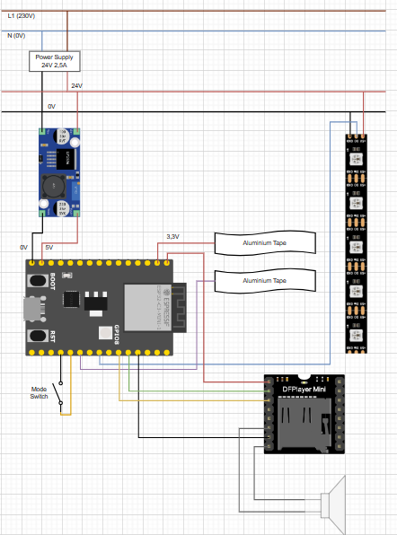

# Handleiding
In dit document gaan we uitleggen hoe je dit project moet maken.

## Materiaallijst + prijs
Dit is het materiaal wat je nodig hebt om dit te maken. Opgelet dit is een prijs per tegel! Hieronder in het document staat een verwijzing naar github hierin staan de linkjes. In deze materiaallijst staat nog geen houten plank dus let daarop.  

## 3D prints
 
 Voor we beginnen met alles, printen we alle onderdelen:
 - De tegel (4 corners)
 - Zijkanten van de tegel (voor afwerking)
 - Doos voor elektronica
 - Deksel voor het doosje

 Al deze tekeningen zijn te vinden op github (Zie linkje onderaan het document). Natuurlijk kun je dit ook maken met andere materialen bv. hout.

## elektronica

Hieronder vindt je het elektrisch schema. Neem het geprinte doosje zodat je de elektronica er mooi in kan opbergen. Voor de rest heb je alleen een soldeerbout en tin nodig.

## Bevestigen

### Benodigdheden
- Houten plaat
- 3D geprinte tegel (4 Corners)
- PolyCarbonate plaat
- Elektronica doosje

De tegel die wij gemaakt hebben is 400 x 400 mm groot. Dus zaag je een plaat van 400 x 400mm.

### Hier de stappen om het in elkaar te steken:

1. Bevestig het bakje eerst aan de tegels en zorg ervoor dat de kabels goed liggen 
2. Neem de houten plaat en boor op de juiste plaatsen. Zaag ook in het midden een opening waarin je het bakje kan zetten.
3. Bevestig de 4 corners met het bevestigde bakje op de houten plaat d.m.v. een schroef en een moer. Indien nodig kan je ter versteviging nog wat lijm aanbrengen.

4. Je hebt dan nog een deksel om de componenten in het bakje te beschermen

##  Detectie

### Benodigheden
- Aluminium tape
- seal strip
- De tegel

 ### Hier de uitleg om dit werkende te krijgen:

1. Plaats aan de zijkant de seal strip D-profile. Deze zorgt ervoor wanneer je van de tegel stapt het Polycarbonaat terug omhoog zal gaan en geen contact meer zal maken.

2.  Aan de zijkant zie je twee gleufjes plak daar aluminium tape in. Het ene gleufje is voor de plus en de andere voor de min kant bevestig de kabels van de detectie daarop aan.

3. Plak op het polycarbonaat een breedt stukje aluminium tape en zorg ervoor dat de plus en de min connectie kunnen maken.

Als alles goed gegaan is zou de detectie nu perfect moeten werken.
In de onderstaande foto een tekening hier zie je waar alles moet bevestigd worden

## Ledstrip en speaker

Bevestig aan de binnenkant tegen de boord de ledstrips en verbindt deze met de ESP-32. De speaker plaats je in het bakje perfect in de voorziene openening. Sluit ook deze aan op de ESP-32.

